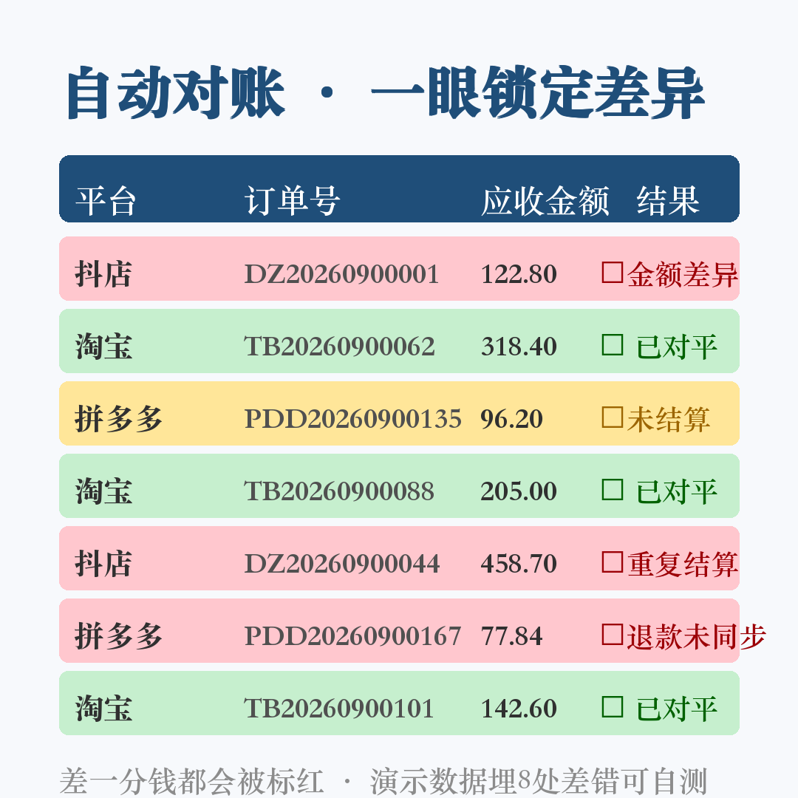
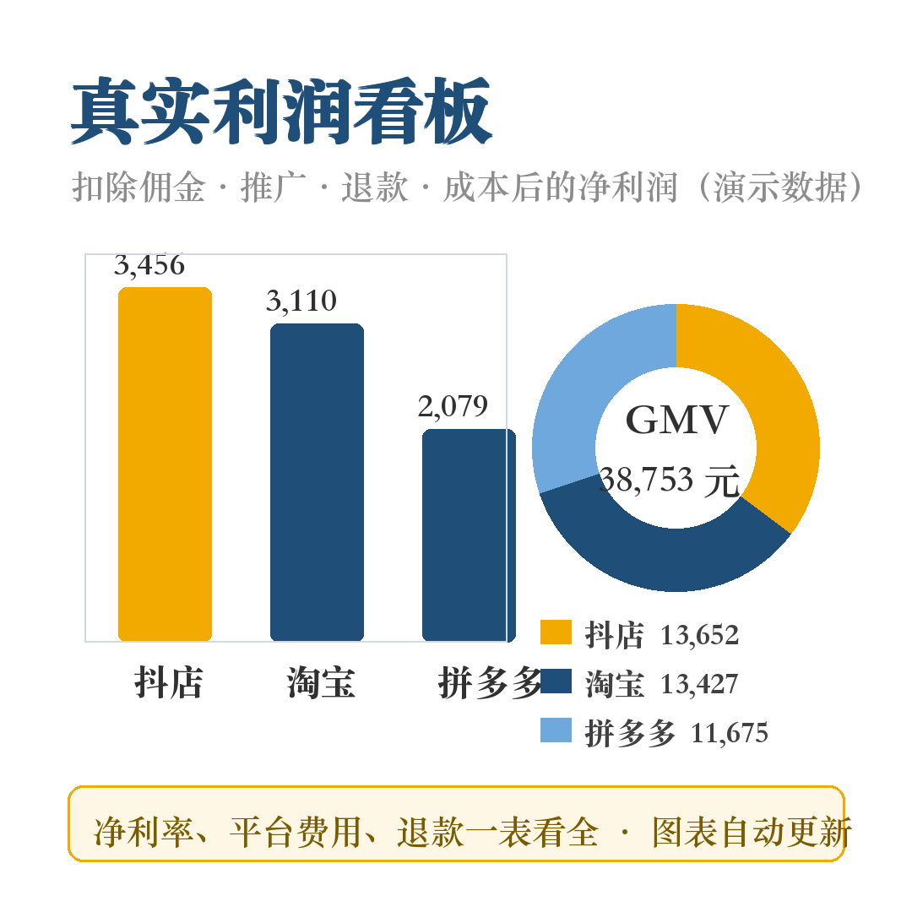

# 电商对账 Lite — 免费多平台订单对账工具（抖音 / 淘宝 / 拼多多 / 京东）

做电商的都懂：月底三个后台各导一张表，人工一单一单对，对到眼瞎还总怕漏。

这个仓库提供一套**免费可商用自用的对账方案**，两种用法任选：

## 🌐 用法一：在线小工具（免下载）

打开 **GitHub Pages 在线版**（`docs/index.html`，或本仓库 Pages 链接）：

- 从 Excel/WPS 复制订单表和结算账单，粘贴进网页
- 点「开始对账」，逐笔核对，差一分钱都标红
- **数据不出浏览器**：纯本地 JS 计算，不上传任何内容
- 自动抓 4 类差错：⚠未结算 / ❌金额差异 / ❌重复结算 / ❌退款未同步 / 🔔疑似多结算孤儿账单

## 📊 用法二：Excel 模板（下载即用）

下载 [`ecom-recon-lite.xlsx`](https://rongk989-art.github.io/ecom-recon-lite/ecom-recon-lite.xlsx)（兼容 WPS / Office 2016+，无宏无 VBA）：

- 100 行自动对账引擎，粘贴数据自动出结果，红黄绿高亮
- 自带 12 单演示数据（埋 2 处差错：1 未结算 + 1 金额差异），打开【自动对账】可自测引擎
- 对账原理：**应收（实付+运费）＝ 实际到账 + 佣金 + 推广费 + 退款扣回**，差 > 0.01 元即标红

## 对账原理

每一笔订单，两边必须相等：

```
应收金额（实付 + 运费） = 实际到账 + 佣金 + 推广费 + 退款扣回
```

| 结果 | 含义 |
|------|------|
| ✓ | 两边一致（误差 ≤ 0.01 元） |
| ⚠未结算 | 订单存在，资金账单查无此单（平台漏打款/未到结算周期） |
| ❌金额差异 | 两边金额对不上，拿着订单号找平台客服 |
| ❌重复结算 | 同一订单号结算了 2 次以上 |
| ❌退款未同步 | 订单有退款但账单没扣回 |

## 🚀 Pro 完整版

免费版适合临时核对。如果你需要**每月例行对账 + 真实利润核算**，Pro 版包含：

- **600 行**多平台自动对账引擎 + 差异清单自动汇总
- **真实利润看板**：GMV / 退款 / 平台费用 / 商品成本 / 净利润 / 净利率，柱状图饼图自动更新，换月一键切换
- **180 单演示数据埋 8 处差错**，打开即可自测引擎准确性
- 图文使用教程 + WPS/Office 2016+ 全兼容

闲鱼搜索「**电商对账模板**」获取 Pro 版。

对账效果（Pro 版演示数据）：



利润看板（Pro 版）：



## License

- 代码与网页工具：MIT
- Excel 模板文件：CC BY-NC 4.0（免费自用，禁止转售）
